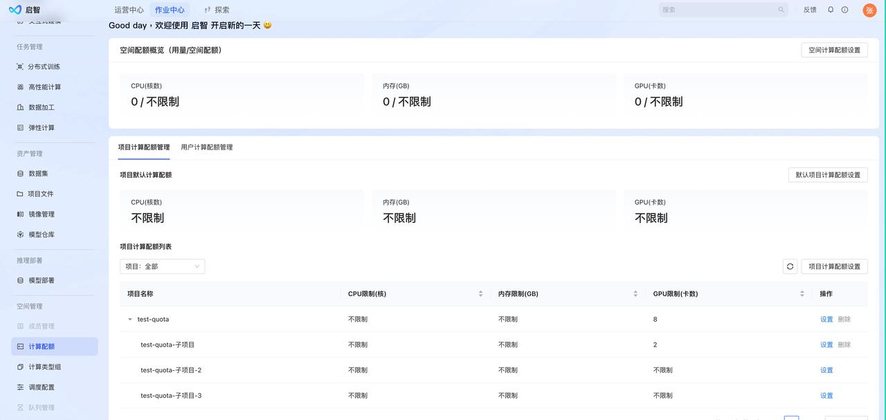
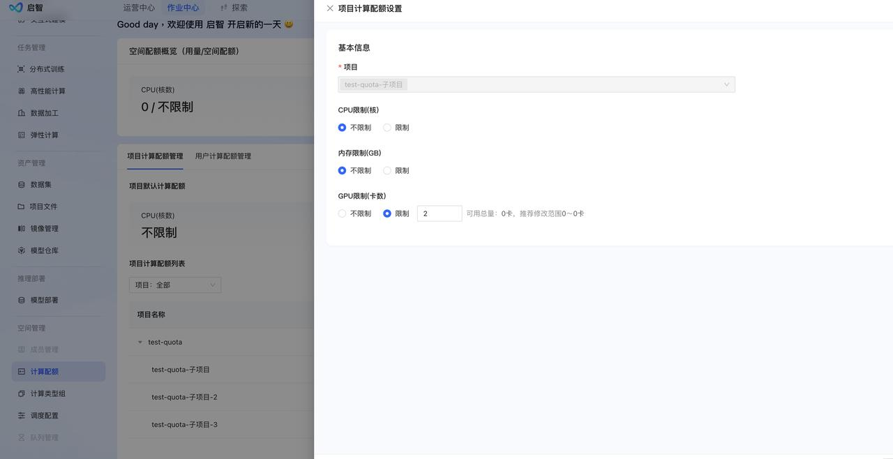
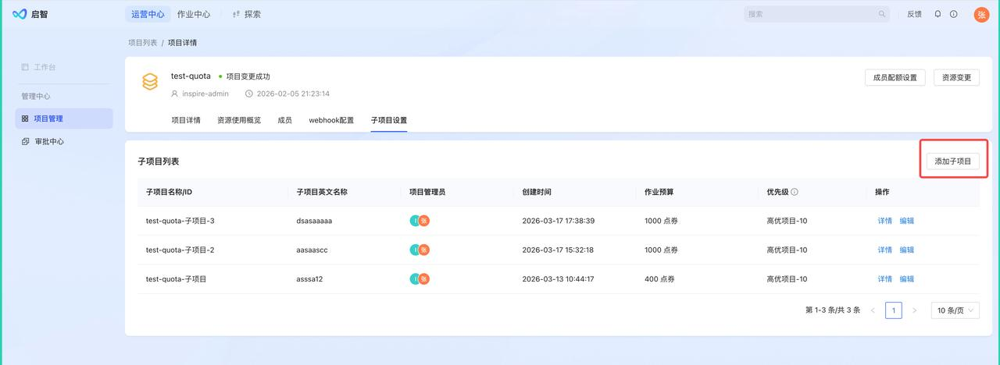
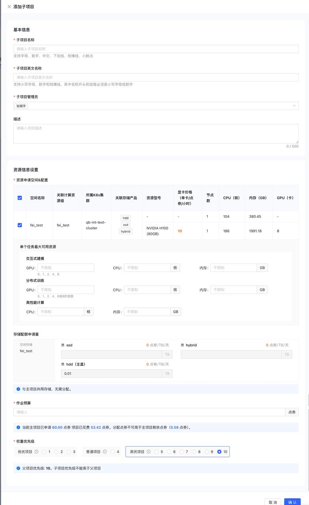
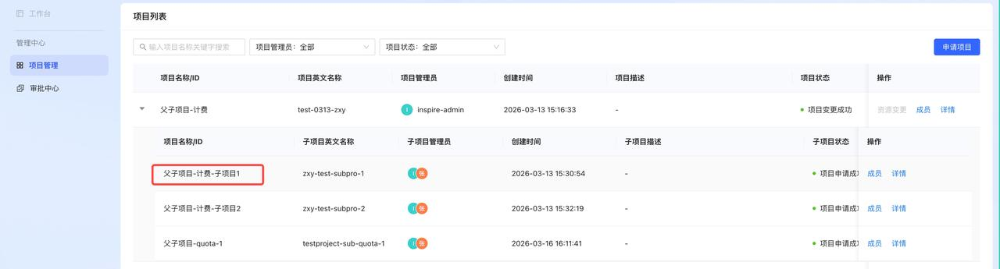
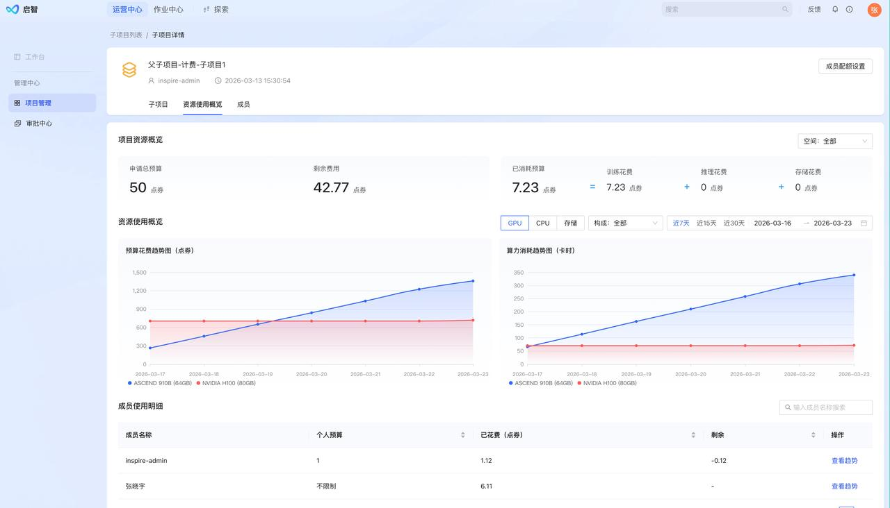

# release note-0323版本

> 说明：该 PDF 的文字使用了子集字体/矢量文本，本地环境没有 OCR/PDF 文字库；以下是用内嵌 CMap 做的机器提取文本，个别字可能不准。原 PDF 中能直接抽取的截图/图片已放在 `image/` 并在下方引用。

## 机器提取文本

父父子子项目目说明
□
项增□子子项目目子管理
□
.
项目目通过资源父请后，
项目目管理员
可以在项目目的详情页算中添加子子项目目
□
.
项目目管理员可以根据自a己⼰父父项目目的情况给子子项目目分配空间和预算。
□无⽆需平台管理员审核□
□
.
子子项目目管理员可以自a请添加子子项目目成员。
□无⽆需父父项目目管理员审批□
子子项目目数据看板
□
.
子子项目目也可以计入⼊项目目详情查看资源消耗情况。
□
.
子子项目目使用需方方式完全和父父项目目□同，使用需方方式保目一查致。
子子项目目独立立配额管控
□
.
子子项目目的空间下使用需限制条件可以独立立设置，如果需要额件管控，可以资系空间管理员进行资单独设
置。□子子项目目q以分限制，公用需父父项目目qto□a□
□

## PDF 内嵌图片

